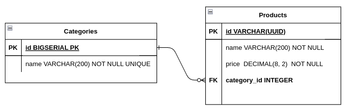

# Produtos e Categorias
#### Serviço de back-end responsável por gerenciar produtos e suas categorias
#### Esse serviço possui uma API REST e um banco de dados PostgreSQL, com imagens Docker orquestradas em um container utilizando docker-compose

##

|Método	|Endpoint	|Responsabilidade|
| --- | --- |--- |
|POST	|/categories	|Criação de categorias|
|GET	|/categories	|Lista todos os categorias|
|GET	|/categories/:id	|Retorna os dados de uma categoria|
|PATCH	|/categories/:id	|Atualiza os dados de uma categoria|
|DELETE	|/categories/:id	|Deleta categorias do banco|
|POST	|/products	|Criação de produtos|
|GET	|/products	|Lista todos os produtos|
|GET	|/products/:id	|Retorna os dados de um produto|
|PATCH	|/products/:id	|Atualiza os dados de um produto|
|DELETE	|/products/:id	|Deleta produtos do banco|
|GET	|/products/category/:category_id	|Retorna os dados dos produtos pertencentes a categoria dona do id|

## Relacionamento da tabelas de produtos e categorias:

